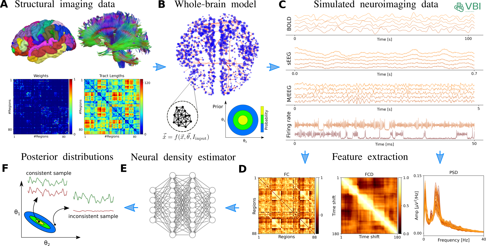

.. raw:: html

   <link rel="stylesheet" type="text/css" href="_static/custom.css">

Virtual Brain Inference (VBI)
##############################

.. image:: _static/vbi_log.png
   :alt: VBI Logo
   :width: 200px
   :align: center

The **Virtual Brain Inference (VBI)** toolkit is an open-source, flexible solution tailored for probabilistic inference on virtual brain models. It integrates computational models with personalized anatomical data to deepen the understanding of brain dynamics and neurological processes. VBI supports **fast simulations**, comprehensive **feature extraction**, and employs **deep neural density estimators** to handle various neuroimaging data types. Its goal is to bridge the gap in solving the inverse problem of identifying control parameters that best explain observed data, thereby making these models applicable for clinical settings. VBI leverages high-performance computing through GPU acceleration and C++ code to ensure efficiency in processing.

Workflow
========

Installation
============

.. code-block:: bash

    conda env create --name vbi python=3.10
    conda activate vbi
    git clone https://github.com/ins-amu/vbi.git
    cd vbi
    pip install .
    # pip install -e .[all,dev,docs]

.. toctree::
   :maxdepth: 2
   :caption: Contents:

   models

Examples
=========

.. toctree::
   :maxdepth: 2
   :caption: Contents:

   examples/intro
   examples/intro_feature
   examples/do_cpp
   examples/do_nb
   examples/vep_sde
   examples/mpr_sde_cupy
   examples/mpr_sde_numba
   examples/jansen_rit_sde_cpp
   examples/jansen_rit_sde_cupy
   examples/ww_sde_torch_kong
   examples/ghb_sde_cupy

.. toctree::
    :maxdepth: 2
    :caption: API Reference

    API

Indices and tables
==================

* :ref:`genindex`
* :ref:`modindex`
* :ref:`search`

