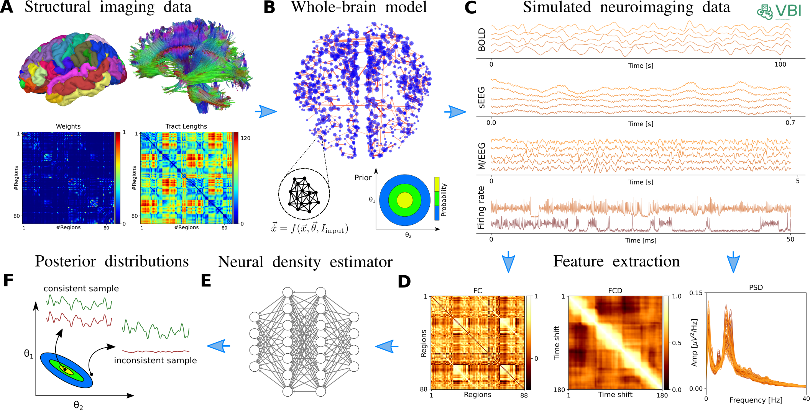

.. raw:: html

   <link rel="stylesheet" type="text/css" href="_static/custom.css">

The Virtual Brain Models
========================

To build a virtual brain model the process begins with parcellating the brain into regions using anatomical data, typically derived from T1-MRI scans. Each region, represented as nodes in the network, is then equipped with a neural mass model to simulate the collective behavior of neurons within that area. These nodes are interconnected using a structural connectivity (SC) matrix, typically obtained from diffusion-weighted magnetic resonance imaging (DW-MRI). The entire network of interconnected nodes is then simulated using neuroinformatic tools, such as The Virtual Brain (``TVB``) [Sanz-Leon2015]_, replicating the intricate dynamics of brain activity and its associated brain imaging signals ((s)EEG/MEG/fMRI). This approach offers insights into both normal brain function and neurological disorders. In the following, we describe commonly used whole-brain network models corresponding to different types of neuroimaging recordings.

Wilson-Cowan model
------------------

The Wilson-Cowan model [Wilson72]_ is a seminal neural mass model that describes the dynamics of connected excitatory and inhibitory neural populations, at cortical microcolumn level. It has been widely used to understand the collective behavior of neurons and simulate neural activities recorded by methods such as local field potentials (LFPs) and EEG. The model effectively captures phenomena such as oscillations, wave propagation, pattern formation in neural tissue, and responses to external stimuli, offering insights into various brain (dys)functions, particularly in Parkinson's disease [Duchet2021average]_, [Sermon2023sub]_.

We focused on a simplified model for generation of beta oscillation within the cortex-subthalamic nucleus-globus pallidus network [Pavlides2015]_. The model incorporates a closed-loop connection from the STN back to the cortex, represented by a single inhibitory connection with a time delay. However, it does not include feedback via the indirect pathway (cortex-striatum-GPe), as experimental evidence suggests this pathway is not essential for generating beta oscillations [Wei2015]_. Instead, the GPe receives a constant inhibitory input from the striatum, consistent with observations from Parkinson's disease models:

.. math::

   \tau_S \dot{S}(t) = F_S (w_{CS} E(t - T_{CS}) - w_{GS} G(t-T_{GS})) - S(t)  
   
   \tau_G \dot{G}(t) = F_G (w_{SG} S(t - T_{SG}) - w_{GG} G(t-T_{GG}) - Str) - G(t)  
   
   \tau_E \dot{E}(t) = F_E (-w_{SC} S(t - T_{SC}) - w_{CC} I(t-T_{CC}) + C) - E(t)  
   
   \tau_I \dot{I}(t) = F_{I} (w_{CC} E(t-T_{CC})) - I(t)  
   
   F_i (x) = \frac{M_i}{1+\big( \frac{M_i - B_i}{B_i} \big) \exp{\big(\frac{-4x}{M_i} \big)}}, \quad i \in \{S, G, E, I \}

where the functions :math:`S`, :math:`G`, :math:`E`, and :math:`I` represent the firing rates of the STN, GPe, and the excitatory and inhibitory populations, respectively. The parameters :math:`T_{ij}` denote the synaptic connection time delays from population :math:`i` to population :math:`j`, while :math:`T_{ii}` represents the time delay of self-connections. The synaptic weights, :math:`w_{ij}`, follow the same subscript conventions as the time delays, indicating the influence of the presynaptic neuron's firing rate on the postsynaptic neuron. The membrane time constants are denoted by :math:`\tau_i`. A constant input, :math:`C`, is provided to the excitatory population in the cortex to account for a constant component of both extrinsic and intrinsic excitatory inputs, while :math:`Str` represents the constant inhibitory input from the striatum to the GPe. Lastly, :math:`F_{i}` are the activation functions.

The nominal parameter values and the prior range for the target parameters are summarized in the following table.

.. list-table:: Parameter descriptions for capturing whole-brain dynamics using **Wilson-Cowan** neural mass model.
   :name: table:WCo
   :header-rows: 1
   :class: color-caption

   * - Parameters
     - Description
     - Value
     - Prior
   * - T\ :sub:`SG`
     - Delay from STN to GPe
     - 6 ms
     -
   * - T\ :sub:`GS`
     - Delay from GPe to STN
     - 6 ms
     -
   * - T\ :sub:`GG`
     - Self delay of GPe
     - 4 ms
     -
   * - T\ :sub:`CS`
     - Delay from cortex to STN
     - 5.5 ms
     -
   * - T\ :sub:`SC`
     - Delay from STN to cortex
     - 21.5 ms
     -
   * - T\ :sub:`CC`
     - Self delay of cortex
     - 4.65 ms
     -
   * - τ\ :sub:`S`
     - Time constant for STN
     - 12.8 ms
     -
   * - τ\ :sub:`G`
     - Time constant for GPe
     - 20 ms
     -
   * - τ\ :sub:`E`
     - Time constant for excitatory neurons
     - 11.59 ms
     -
   * - τ\ :sub:`I`
     - Time constant for inhibitory neurons
     - 13.02 ms
     -
   * - M\ :sub:`S`
     - Maximum firing rate of STN
     - 300 spk/s
     -
   * - M\ :sub:`G`
     - Maximum firing rate of GPe
     - 400 spk/s
     -
   * - M\ :sub:`EI`
     - Maximum firing rate of excitatory neurons
     - 75.77 spk/s
     -
   * - M\ :sub:`I`
     - Maximum firing rate of inhibitory neurons
     - 205.72 spk/s
     -
   * - B\ :sub:`S`
     - Baseline firing rate of STN
     - 10 spk/s
     -
   * - B\ :sub:`G`
     - Baseline firing rate of GPe
     - 20 spk/s
     -
   * - B\ :sub:`EI`
     - Baseline firing rate of excitatory neurons
     - 17.85 spk/s
     -
   * - B\ :sub:`I`
     - Baseline firing rate of inhibitory neurons
     - 9.87 spk/s
     -
   * - C
     - Excitatory input to cortex
     - 172.18 spk/s
     -
   * - Str
     - Inhibitory input from striatum to GPe
     - 8.46 spk/s
     -
   * - w\ :sub:`GS`
     - Synaptic weight from GPe to STN
     - 1.33
     - U(0,10)
   * - w\ :sub:`SG`
     - Synaptic weight from STN to GPe
     - 4.87
     - U(0,10)
   * - w\ :sub:`GG`
     - Self synaptic weight among GPe
     - 0.53
     - U(0,20)
   * - w\ :sub:`CS`
     - Synaptic weight from cortex to STN
     - 9.97
     - U(0,20)
   * - w\ :sub:`SC`
     - Synaptic weight from STN to cortex
     - 8.93
     - U(0,10)
   * - w\ :sub:`CC`
     - Self synaptic weight among cortex
     - 6.17
     - U(0,10)

Jansen-Rit model
----------------

The Jansen-Rit neural mass model [Jansen1995]_ has been widely used to simulate physiological signals from various recording methods like intracranial LFPs, and scalp MEG/EEG recordings. For example, it has been shown to recreate responses similar to evoked-related potentials after a series of impulse stimulations [David2003]_, [David_etal06]_, generating high-alpha and low-beta oscillations (with added recurrent inhibitory connections and spike-rate modulation) [Moran2007]_, and also seizure patterns similar to those seen in temporal lobe epilepsy [Wendling2001]_.
This biologically motivated model comprises of three main populations of neurons: excitatory pyramidal neurons, inhibitory interneurons, and excitatory interneurons. These populations interact with each other through synaptic connections, forming a feedback loop that produces oscillatory activity governed by a set of nonlinear ordinary differential equations [JansenRit]_, [David2003]_, [Kazemi2022]_.

.. math::

    \dot{y}_{0i}(t) &=& y_{3i}(t); \quad \dot{y}_{1i}(t) = y_{4i}(t); \quad \dot{y}_{2i}(t) = y_{5i}(t) \\
    \dot{y}_{3i}(t) &=& A \, a\, \text{S}(y_{1i}(t)-y_{2i}(t)) - 2a \, y_{3i}(t) - a^2 y_{0i}(t) \\
    \dot{y}_{4i}(t) &=& A \, a\Big( P(t) + C_2 \, \text{S}(C_1 y_{0i}(t)) + G \, \text{H}_i \Big) 
                     -2a y_{4i}(t) -a^2 y_{1i}(t) \\
    \dot{y}_{5i}(t) &=& B \, b \Big( C_4\, \text{S}(C_3 y_{0i}(t)) \Big) -2b \,y_{5i}(t) -b^2 y_{2i}(t) \\
    \text{S}(v) &=& \frac{v_{max}}{1+\exp(r(v_0-v))} \\
    \text{H}_{i} &=& \sum_{j=1}^{N} \text{SC}_{ij} \, \text{S} (y_{1j}-y_{2j})

.. list-table:: Parameter descriptions for capturing whole-brain dynamics using **Jansen-Rit** neural mass model.
   :name: table:JR
   :header-rows: 1
   :class: color-caption

   * - **Parameters**
     - **Description**
     - **Value**
     - **Prior**
   * - *A*
     - Excitatory PSPA
     - 3.25 mV
     -
   * - *B*
     - Inhibitory PSPA
     - 22 mV
     -
   * - *1/a*
     - Time constant of excitatory PSP (*a* = 100 s\ :sup:`-1`)
     -
     -
   * - *1/b*
     - Time constant of inhibitory PSP (*b* = 50 s\ :sup:`-1`)
     -
     -
   * - C\ :sub:`1`, C\ :sub:`2`
     - Average numbers of synapses between EP
     - 1 C, 0.8 C
     -
   * - C\ :sub:`3`, C\ :sub:`4`
     - Average numbers of synapses between IP
     - 0.25 C
     -
   * - v\ :sub:`max`
     - Maximum firing rate
     - 5 Hz
     -
   * - v\ :sub:`0`
     - Potential at half of maximum firing rate
     - 6 mV
     -
   * - r
     - Slope of sigmoid function at *v\ :sub:`0`*
     - 0.56 mV\ :sup:`-1`
     -
   * - C
     - Average numbers of synapses between neural populations
     - 135
     - U(100, 500)
   * - G
     - Scaling the strength of network connections
     - 1.5
     - U(0, 5)

EP: excitatory populations, IP: inhibitory populations, PSP: post synaptic potential, PSPA: post synaptic potential amplitude.

References
----------

.. [Wilson72] Wilson, H. R., & Cowan, J. D. (1972). Excitatory and inhibitory interactions in localized populations of model neurons. Biophysical Journal, 12(1), 1-24.

.. [Duchet2021average] Duchet, B., & Others. (2021). Average neural activity in Parkinson's disease. *Neuroscience Journal*.

.. [Sermon2023sub] Sermon, J., & Others. (2023). Subcortical effects of Parkinson's. *Brain Research*.

.. [Sanz-Leon2015] Sanz-Leon, P., Knock, S. A., Spiegler, A., & Jirsa, V. K. (2015). Mathematical framework for large-scale brain network modeling in The Virtual Brain. *NeuroImage, 111*, 385-430. https://doi.org/10.1016/j.neuroimage.2015.01.002

.. [Pavlides2015] Pavlides, A., Hogan, S. J., & Bogacz, R. (2015). Computational models describing possible mechanisms for generation of excessive beta oscillations in Parkinson's disease. *PLoS Computational Biology, 11*(12)*, e1004609. https://doi.org/10.1371/journal.pcbi.1004609

.. [Wei2015] Wei, W., Wang, X., & Chen, X. (2015). The role of indirect pathway in beta oscillation of basal ganglia-thalamocortical circuitry in Parkinson's disease. *Frontiers in Computational Neuroscience, 9*, 63. https://doi.org/10.3389/fncom.2015.00063

.. [Jansen1995] Jansen, B. H., & Rit, V. G. (1995). Electroencephalogram and visual evoked potential generation in a mathematical model of coupled cortical columns. *Biological Cybernetics*, 73(4), 357-366.

.. [Moran2007] Moran, R. J., Kiebel, S. J., Stephan, K. E., Reilly, R. B., Daunizeau, J., & Friston, K. J. (2007). A neural mass model of spectral responses in electrophysiology. *NeuroImage*, 37(3), 706-720. https://doi.org/10.1016/j.neuroimage.2007.05.032.

.. [Wendling2001] Wendling, F., Bartolomei, F., Bellanger, J.-J., & Chauvel, P. (2001). Interpretation of interdependencies in epileptic signals using a macroscopic physiological model of the EEG. *Clinical Neurophysiology*, 112(7), 1201-1218.

.. [David2003] David, O., & Friston, K. J. (2003). A neural mass model for MEG/EEG: coupling and neuronal dynamics. *NeuroImage*, 20(3), 1743-1755. https://doi.org/10.1016/j.neuroimage.2003.07.015.

.. [David_etal06] David, O., Kiebel, S. J., Harrison, L. M., Mattout, J., Kilner, J. M., & Friston, K. J. (2006). Dynamic causal modeling of evoked responses in EEG and MEG. *NeuroImage*, 30(4), 1255-1272. https://doi.org/10.1016/j.neuroimage.2005.10.045.

.. [JansenRit] Jansen, B. H., & Rit, V. G. (1995). Electroencephalogram and visual evoked potential generation in a mathematical model of coupled cortical columns. *Biological Cybernetics*, 73, 357-366.

.. [Kazemi2022] Kazemi, S., & Jamali, Y. (2022). On the influence of input triggering on the dynamics of the Jansen-Rit oscillators network. *arXiv preprint arXiv:2202.06634*.
