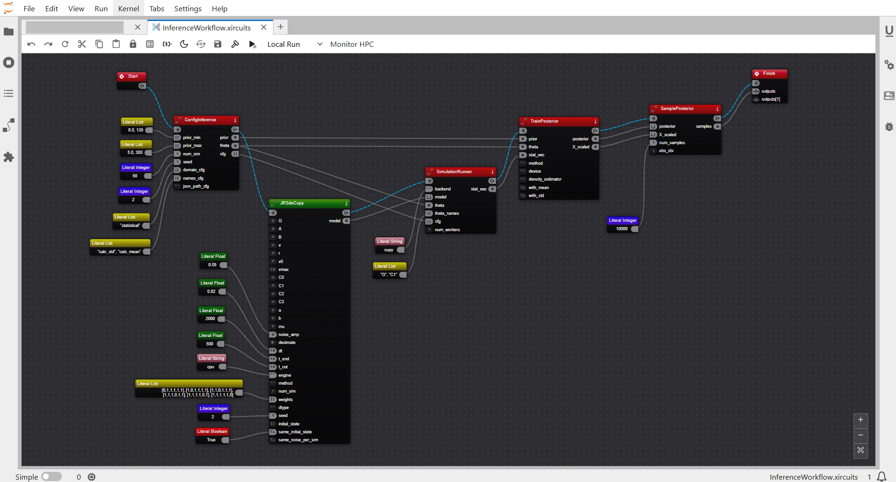

# Summary

Understanding the principles and causal mechanisms underlying complex brain (dys)function is essential for advances in precision medicine. The virtual brain modeling represents a major step forward, combining computational models of brain dynamics with personalized anatomical data to simulate at scales commensurate with neuroimaging modalities. However, there is a lack of widely available tools to address the inverse problem of inferring neural mechanisms from observed brain activity. This work introduces Virtual Brain Inference (VBI), a flexible, scalable, and integrative Python toolkit designed for efficient probabilistic inference on virtual brain models. VBI is now available as an open-source service on the cloud research platform EBRAINS (ebrains.eu). It offers fast simulations of popular whole-brain models, a taxonomy of feature extraction methods, efficient data storage, and advanced probabilistic machine learning algorithms for causal inference from non-invasive and invasive recordings. VBI cloud services on EBRAINS, including demo applications, enable reproducible online collaboration, seamless integration with scalable and secure workflows, fostering research on large cohort datasets, improving generalizability, and potentially clinical translation.

# Statement of Need

VBI (https://github.com/ins-amu/vbi) is a Python-based toolkit tailored for probabilistic inference at the whole-brain scale. A lightweight version with minimal dependencies is available to run online in JupyterLab. It also leverages the flexibility of Python while harnessing the high performance of C++ for optimized computation and massive parallelization using CUDA on GPUs. VBI seamlessly integrates structural and functional neuroimaging data, providing space-efficient storage and memory-optimized batch processing. With its user-friendly API supporting:

- **Whole-brain models**: Wilson-Cowan, Jansen-Rit, Stuart-Landau, Montbrió, Wong-Wang, and Epileptor.
- **Fast simulation**: Just-in-time compilation of models across Python/C++ and CPU/GPU devices.
- **Feature extraction**: Functional connectivity (FC), functional connectivity dynamics (FCD), and power spectral density (PSD).
- **Deep neural density estimators**: Masked autoregressive flows (MAFs; @Papamakarios2017), and neural spline flows (NSFs; @Durkan2019).

Traditional methods such as Markov Chain Monte Carlo (MCMC) and Approximate Bayesian Computation (ABC) face significant challenges in this context [@Sisson2007]. Gradient-free MCMC struggles in high-dimensional settings, while gradient-based approaches often have difficulty converging for bistable systems with switching dynamics, often requiring extensive tuning [@Betancourt2013b] and computational resources [@Hashemi2020]. ABC suffers from the curse of dimensionality and relies on predefined thresholds for sample acceptance, leading to inefficiencies and potential biases when rejecting samples that fall outside narrow criteria [@Jha2022]. VBI leverages advanced Simulation-based Inference (SBI; @cranmer2020frontier), which sidesteps these issues by using only forward simulations and training deep neural density estimators to directly approximate posterior distributions [@gonccalves2020training ; @hashemi2023amortized]. This approach enhances efficiency, scalability, and robustness for inverting complex whole-brain models [@hashemi2024simulation].

Designed for researchers and clinical applications, VBI enables personalized simulations of normal and pathological brain activity, aiding in distinguishing healthy from diseased states, and potentially informing clinical decision making. By addressing the efficient and scalable probabilistic inverse problem, VBI leverages high-performance computing for parallel processing of large-scale datasets [@Ziaeemehr2025].

# Methods

Whole-brain network dynamics are modeled as coupled neural mass models interacting through structural connectivity [@Hashemi2024vbt]:

$$
\dot {\psi}_i (t) = \mathcal{N} (\psi_i) + G \sum_{j=1}^{N}  \mathrm{w}_{ij} \mathcal{H}(\psi_i,  \psi_j(t-\tau_{ij}) )  + z (\psi_i) \xi_i(t),
$$

where $i = 1, 2, \ldots, N$, and $N$ is the number of brain regions. Here, $\psi_i(t)$ represents local neural activity in region $i$, governed by the nonlinear function $\mathcal{N}(\psi_i)$ when uncoupled. Interactions between regions are mediated by the coupling function $\mathcal{H}(\psi_i, \psi_j(t - \tau_{ij}))$, weighted by the structural connectivity $\mathrm{w}_{ij}$ (derived from diffusion-weighted MRI tractography) and delayed by axonal transmission times $\tau_{ij}$. A noise term, $z(\psi_i) \xi_i(t)$, is added as Gaussian noise with:

$$
\langle \xi_i(t) \rangle = 0, \quad \langle \xi_i(t) \xi_j(t') \rangle = 2 D \delta(t - t') \delta_{i,j},
$$

where $D$ is the noise strength. The system’s operating regime emerges from the interplay of global coupling $G$, local bifurcation parameters, and noise, with connectivity structure shaping macroscopic brain activity through delays and weights [@ghosh2008noise; @ziaeemehr2020frequency; @petkoski2019transmission; @sanz2013virtual]. 

VBI relies on three main components:

1. A prior distribution, $p(\vec{\theta})$, describing the possible range of parameters i.e., $\vec\theta \sim p(\vec{\theta})$.
2. A whole-brain simulator, $p(\vec{x} \mid \vec{\theta})$, generating data $\vec{x}$ given parameters $\vec{\theta}$.
3. Low-dimensional features for training deep neural density estimators.

Together, these yield a training dataset $\{(\vec{\theta}_i, \vec{x}_i)\}_{i=1}^{N_{sim}}$, where $N_{sim}$ is the simulation budget. After training, we can efficiently estimate the posterior distribution given observed data, i.e., $p(\vec{\theta} \mid \vec{x}_{obs})$.

The VBI workflow comprises:

1. **Fast simulation**: generating data associated with various neuroimaging recordings.
2. **Feature extraction**: Computing statistical, spatiotemporal, and other features.
3. **Efficient Inference**: Amortized training of deep neural density estimators.

### Evaluation of Posterior Fit

Posterior reliability is assessed using posterior z-scores (denoted by $z$) and shrinkage (denoted by $s$) [@betancourt2017geometric]:

$$
z = \left| \frac{\bar{\theta} - \theta^\ast}{\sigma_{post}} \right|, \quad s = 1 - \frac{\sigma^2_{post}}{\sigma^2_{prior}},
$$

where $\bar{\theta}$ is the posterior mean, $\theta^\ast$ is the true parameter, and $\sigma_{post}$ and $\sigma_{prior}$ are posterior and prior standard deviations, respectively. High shrinkage indicates well-identified posteriors, while low z-scores confirm accurate capture of true values.  Through in silico testing, these metrics indicated the accuracy and reliability of inference for commonly used whole-brain network models and their associated neuroimaging data [@Ziaeemehr2025]. 

![Overview of the VBI workflow: (**A**) A personalized connectome is built using diffusion tensor imaging and a brain parcellation atlas. (**B**) This forms the basis to build a virtual brain model, given control parameters sampled from a prior distribution. (**C**) VBI simulates time series data associated with neuroimaging recordings. (**D**) Data features (such as FC, FCD, PSD) are extracted from simulations. (**E**) Deep neural density estimators are trained on parameter-feature pairs to learn the family of posterior distributions over model parameters. (**F**) The trained network rapidly approximates the posterior for any new observation. (**G**) A flowchart of the VBI modules illustrates the pipeline’s modularity and flexibility, allowing seamless integration of different simulators, feature extraction, and inference tools.](Fig1.png)

### EBRAINS integration

EBRAINS is an open research infrastructure that integrates data, tools, and computational resources for brain-related research, with interoperability as a central design principle. From the perspective of the VBI project, EBRAINS serves as a deployment environment in which the VBI toolbox can be installed after each release and subsequently shared with the broader research community. This mode of deployment enhances reproducibility and lowers the barrier to entry for users without programming expertise, as it enables direct access to the tools through a running JupyterLab environment at lab.ebrains.eu. To further improve usability, we are also developing a graphical user interface (GUI) for VBI components, allowing users to configure simulation workflows through drag-and-drop interactions. This interface is implemented as a JupyterLab extension.

# Acknowledgements

This project/research has received funding from the European Union's Horizon Europe Programme under the Specific Grant Agreement No. 101147319 (EBRAINS 2.0 Project), No. 101137289 (Virtual Brain Twin Project),  No. 101057429 (project environMENTAL), and government grant managed by the Agence Nationale de la Recherche reference ANR-22-PESN-0012 (France 2030 program). The funders had no role in study design, data collection and analysis, decision to publish, or preparation of the manuscript. 

# References